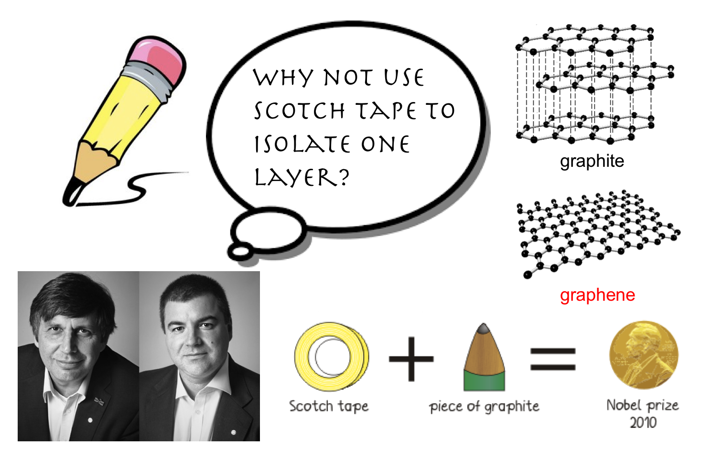
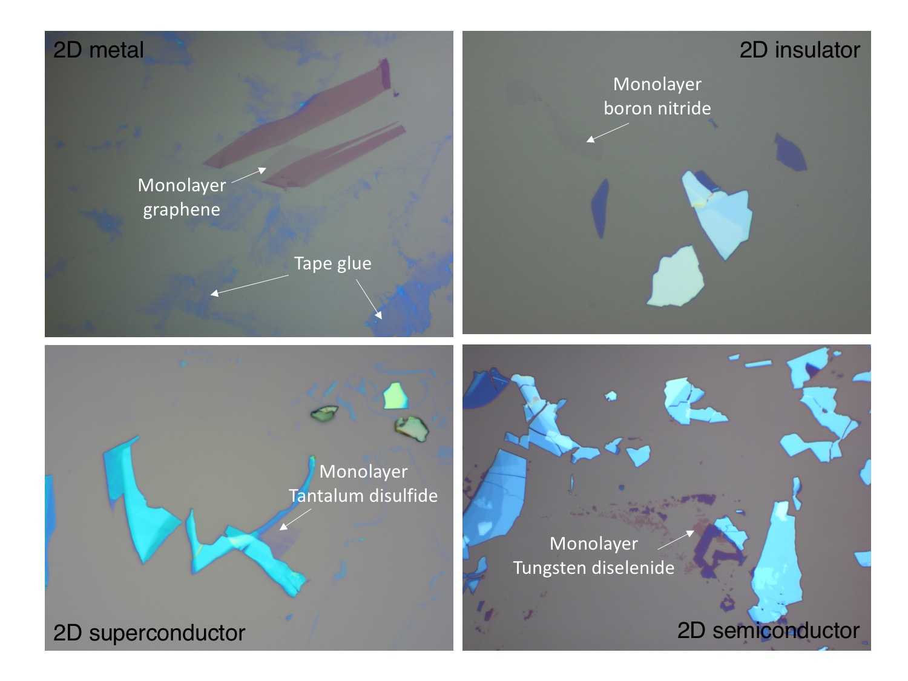
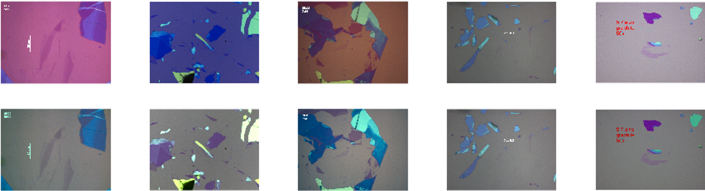
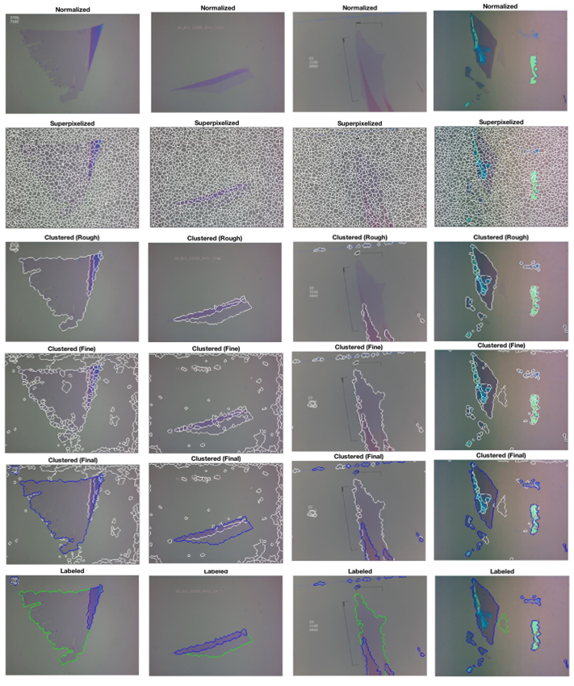
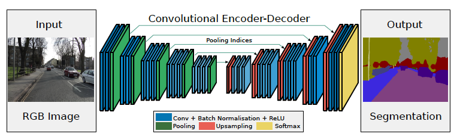
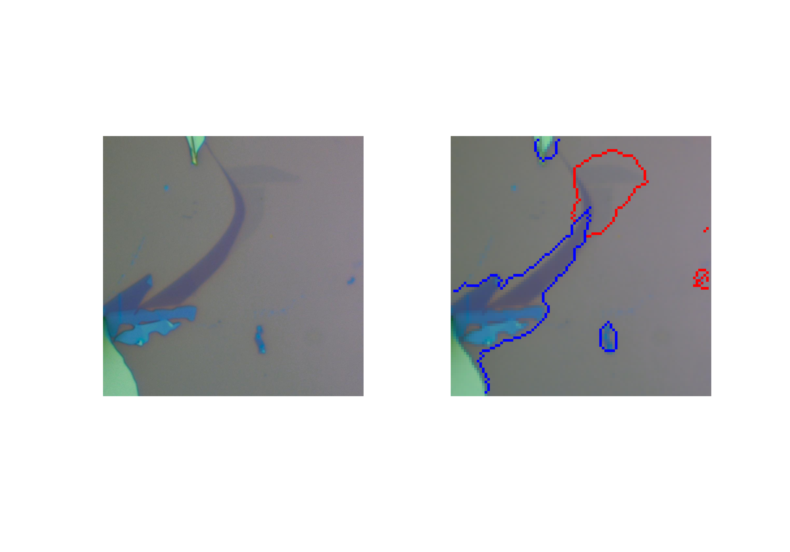
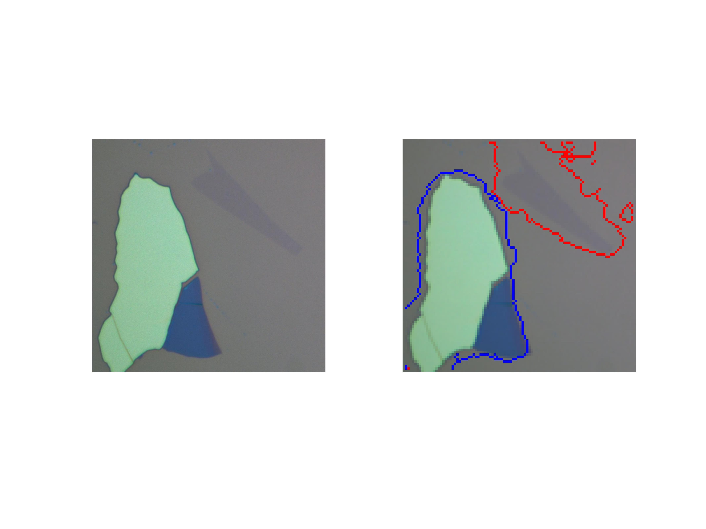
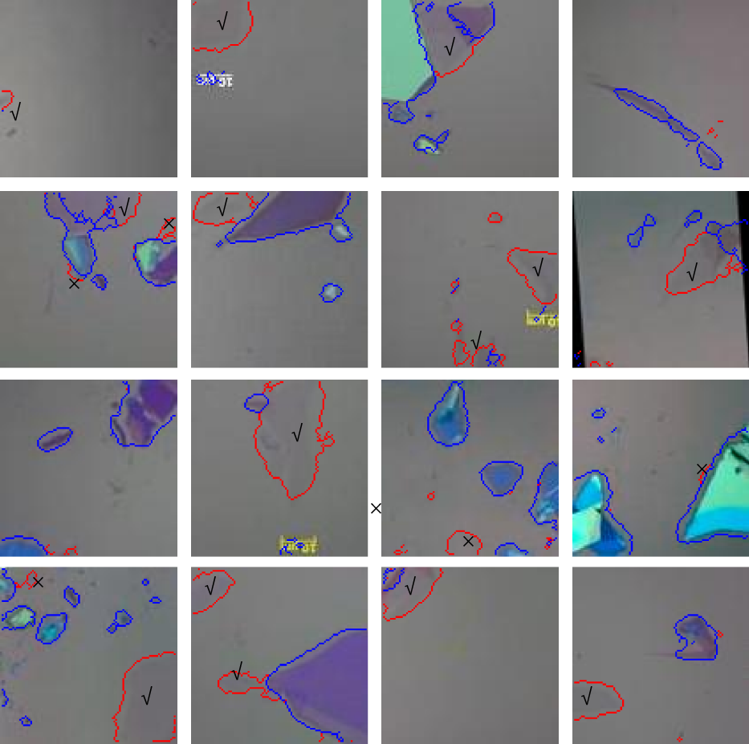

# Smart Classification of 2D Nano-materials
**Semantic neural network to realize pixel-wise classification of 2D nano-material using Matlab.**

### Overview

We present identification of monolayer nano-material using semantic pixel-wise segmentation methods. 
We start with optical images of graphene/graphite flakes taken under various laboratory conditions. 
With the help of SLIC superpixelization and DBSCAN clustering, we are able to associate each pixels in the optical image to three classes: "background", "monolayer" and "multilayer". 
We then perform data augmentation and feed the labeled images to a semantic segmentation network for pixel-wise classification.

#### List of codes
* Step1_labeling.mlx
* Step2_data_generation.mlx
* Step3_training.m
* Step4_testwithExampleImage.m
* configure.m

#### List of files and folders
* Functions used in codes above are in "/functions" and "/kovesi"
* Example images for Step1_labeling.mlx are in "/Train_example"
* Cropped images generated by data augmentation for Step3_training.m are in "/Training_data"
* trainNet.mat is the training outcome from Step3_training.m
* trainNet.mat is also used as SegNet input for Step4_testwithExampleImage.m 
* Test images for Step4_testwithExampleImage.m are in "/Test_example"

### Background

In 2003, one ingenious physicist took a block of graphite, some Scotch tape and a lot of patience and persistence and produced a magnificent new wonder material that is a million times thinner than paper, stronger than diamond, more conductive than copper. 
It is called graphene.
It took the physics community by storm when the first paper appeared in [Science magazine](http://science.sciencemag.org/content/306/5696/666) in 2004, and it is now one of the most highly cited papers in materials physics (40800 citations up to date).
In 2010, the Nobel Prize in Physics was awarded jointly to *Andre Geim* and *Konstantin Novoselov* "**for ground breaking experiments regarding the two-dimensional material graphene**". 

Despite numerous groundbreaking discoveries and proliferating research on graphene and 2D materials beyond graphene, the technique of producing such high-quality 2D materials remains almost unchanged as it is first invented: mechanical exfoliations.
It relies on using Scotch tape to repeatedly peel away the the top layer to achieve progressively thinner flakes attached to the tape.
After transferring these flakes onto the surface of a silicon wafer, the flakes with different thicknesses are randomly distributed on a centimeter-scale wafer.
Researchers need to spend hours seating in front of a microscope, in order to search for one eligible flake that are truly one atom thick.
This task is very time-consuming and difficult especially for inexperienced researchers.

**The goal of our work is to implement an algorithm that segments the microscopic images into regions labeled as "background", "monolayer", and "multilayer". To achieve this goal, we firstly developed an unsupervised image segmentation algorithm to facilitate the pixel-by-pixel labeling. Secondly, we used the labeled data to train an encoder-decoder convolutional neural network archetecture. Lastly, we evaluated the trained network and discussed the possibility of transfer learning in which the trained network is adapted to a new dataset of a different but similar 2D crystals.**

### Step 1: Pixel-wise labeling for training data

We aim to label the training image pixel-by-pixel with one of the three labels: 1-background; 2-monolayer; 3-multilayer.
Since each image contains millions of pixels, it is a formidable job to label them one by one. 
Here we come up with proper superpixelization and clustering method to greatly reduce the work load and facilitate the labeling process.

First, we resize the image scaled by 0.1 and normalize its color distribution in [l\*a\*b space](https://www.mathworks.com/discovery/lab-color.html).
Second, we use [simple linear iterative clustering (SLIC)](https://ieeexplore.ieee.org/abstract/document/6205760/) method to merge neighboring pixels into superpixels based on their similarity in position and color space.
Third, we further combine the superpixels according to similarities and achieve the desired level of segmentations of the images by [density based spatial clustering of applications with noise (DBSCAN)](http://www.aaai.org/Papers/KDD/1996/KDD96-037.pdf) method.
In this way, we obtain superpixels with meaningful boundaries to allow label assignment.

#### Normalization in color space

In order to facilitate the pixel-by-pixel labeling of the microscopic images, we need to develop an unsupervised learning algorithm to segment each image into several regions according to the similarities of the distributions of the pixels in each region in the color and/or real spaces. 
To achieve this goal, several image segmentation methods were tried, including L\*a\*b space [K-means clustering](https://www.mathworks.com/help/stats/kmeans.html), [edge detection](https://www.mathworks.com/discovery/edge-detection.html) based segmentation, and superpixel based segmentation. As all three methods rely heavily on the optical contrast of different regions in the images, we need to firstly find a way to normalize the images in the color space to minimize the variations of the images taken under different conditions.

The first row in the figure below shows the different hues and brightnesses of some of the images. 
Intuitively, we need to normalize the color according to a "reference" color point. 
As we used Si wafers as the substrates for all the images, it is then possible to use the pixels in the "background" regions as the reference color. 
The images were firstly projected from the RGB color space to the L\*a\*b color space, in which L, a and b indicate respectively the lightness and the components of green-red and blue-yellow.
The normalization transformation can be expressed as L <= 50L/L_ref, a <= a-a_ref, b <= b-b_ref, and the resulting images are shown in the second row of the figure below. It is clearly seen that the color distributions of each classes become very similar after normalization.

#### Superpixelization and DBSCAN clustering

In order to segment the image into regions with meaningful boundaries, several superpixelization based clustering algorithms are used. 
[Peter Koveski's Image Segmentation Package](http://www.peterkovesi.com/matlabfns/) is used.
In this algorithm, we firstly over-segment the input images into superpixels with the SLIC method. 
Superpixel is a clustering of neighboring pixels with perceptually meaningful similarities. 
The [SLIC]((https://ieeexplore.ieee.org/abstract/document/6205760/)) method adapts the [K-means clustering](https://www.mathworks.com/help/stats/kmeans.html) algorithm into the superpixelization problems. 
The distance used in the K-means clustering algorithm is the distance in the combinational pixel position space (x, y) and the L\*a\*b color space (l, a, b) with a specified scaling factor. 
To eliminate the searching effort, the algorithm also confined the regions of k-means searching to a limited range instead of the entire image as in the standard K-means clustering algorithm. 
In order to make sure the superpixelization is able to capture finest features of the images, we increased the total number of superpixels and decreased the minimum superpixel diameters. 
The first and second rows of figure below show respectively some typical normalized images and the corresponding superpixel segmentations after the SLIC algorithm.

The second step is to further combine the superpixels according to similarities and achieve the desired level of segmentations of the images. 
Although the color distributions of each desired cluster may be tight and regular, the spans in the pixel space of the desired clusters may be in very ireggular shape, and thus could not be determined by simply thresholding a distance function. 
This is when the spectral clustering comes into place. Here we adapted the [DBSCAN](http://www.aaai.org/Papers/KDD/1996/KDD96-037.pdf) method and used the medians of the scaled combination of the L\*a\*b color space and the pixel space distances as the measure of weigths of the edges between two superpixel vertices. 
One hyperparameter that is very critical in this algorithm is the threshold value that indicates the maximum distances of two superpixels that can be combined into a single cluster. 
Because the color-pixel distance between the background and the monolayer regions are usually substantially smaller than the variations within the background and/or the multilayer regions, a single threshold value would either incorrectly combined the monolayer regions into the background regions, or segment the background and the multilayer regions into too many clusters.
This aspect is clearly shown as the threshold is set to be relatively large and small, respectively, in the third and fourth row of the figure above.
The fifth row is the final ourcome of labeling. 
The green boundaries indicate the "monolayer" region, while the blue boundaries indicate the "multilayer" region.

***The key steps is summarized as follows:***

1. Draw randomly an image (without replacement) from the unlabeled image sets, and resize it by one tenth of its original size.

2. Normalize the resized image in the L\*a\*b color space with respect to the background color.

3. Superpixelize the normalized image with the SLIC algorithm.

4. Perform the DBSCAN clustering based on the superpixelization result, with two different well-tuned distance threshold values (called fine clustering and rough clustering).

5. Propose the bigest cluster in the rough clustering results as the "background" labeled region, and the rest as the "multilayer" regions. And combine the fine clustering results in the "background" region and the rough clustering results in the "multilayer" regions as the new clusters.

6. Manually determine the "monolayer" regions from the new clusters, and keep the rest clusters labeled as the proposal in the previous step. Then the pixel-by-pixel labeling of the current input image is completed.

### Step 2: Data augmentation

Labeled images are randomly cropped into images with 100*100 pixels. 
Based on these cropped images, training data are generated by data augmentation, such as random left/right or up/down reflection, random shear and random rotation (90, 180, 270 degree).
It helps enlarge our dataset, as well as provides enough variation for training deep learning model.

### Step 3: Semantic segmentation using deep learning

A semantic segmentation network can fulfill pixel-wise classification for given input images, resulting in an image that is segmented by classes.
It can associate each pixel of an image with a class label, i.e. “background”, “monolayer”, “multilayer” in our case.
This [SegNet](https://www.mathworks.com/help/vision/examples/semantic-segmentation-using-deep-learning.html) we use in our paper has an encoder network and a corresponding decoder network, followed by a final pixel-wise classification layer. 

Each encoder in the encoder network performs convolution with several filters to produce a set of feature maps, followed with batch normalized. 
Then an element-wise ReLU layer is applied. 
Then a max-pooling layer with a 2*2 window and stride 2 is performed and result in downsampling of the image by a factor of 2. 
The decoder produces produces sparse feature maps in the decoder network by upsampling its input feature maps using the max-unpooling.
This step utilizes memorized max-pooling indices from the corresponding encoder layers. 
Convolution is then performed on these feature maps with trainable decoder filters to produce dense feature maps, followed with batch normalization.
An element-wise ReLU layer is then applied. 
After equal number of upsampling to match the input size, the final output feature maps are fed to a soft-max classifier for pixel-wise classification.
The predicted segmentation is matched to the class with maximum soft-max probability at each pixel.

In our problem, there is a large variation in the number of pixels from each class in the training dataset. 
For example, number of "background" pixels is expected to be much larger than number of pixels labeled as "monolayer" and "multilayer".
If not handled properly, this imbalance can jeopardize the learning process and the correct labeling of the dominant classes will always be favored. 
It hampers the capability to classify small object in the image.
Therefore, there is a need to weight the loss differently based on the class pixel numbers. 
One way to assign the weights is to compute the ratio of the median of class frequencies based on the entire training set divided by the class frequency. 
The weights are then assigned to each class when calculating the loss function.
This implies that larger classes in the training set have a class weight smaller than 1 and the weights
of the smallest classes are the largest.
In addition to this method, we can manually tune the class weights to optimize the training output.
Another important factor that affects the training performance is the depth of the network.
To demonstrate that, we can also configure networks with different numbers of convolutional layers in the encoder and decoder network (i.e. the depth of the network).

Here we use *segnetLayers* function provided in neural network toolbox by matlab to configure a [SegNet](https://www.mathworks.com/help/vision/examples/semantic-segmentation-using-deep-learning.html) network. 
We are able to modify the depth of the network and specify the class weights described above.
The network can trained in a GPU environment. 
The optimization algorithm used for training is stochastic gradient decent with momentum (SGDM), and the $max\_epoch$ is set to be 10.
It takes approximately 20 min to train each network.

### Step 4: Test the trained SegNet on test data

After implementation of training, we test our network with test images.
We can obtain accuracy of pixel-wise classification for each class, which provides an overview of the network performance.
In general, the semantic segmentation results overlap well for classes that are large, such as "background". 
However, smaller objects like are not as accurate. 
The amount of overlap per class can be measured using the intersection-over-union (IoU) metric, also known as the [Jaccard](https://www.mathworks.com/help/images/ref/jaccard.html) index. 
The IoU metric complies better with the visual results. 
With trained SegNet, we can fulfill pixel-wise classification with accuracy > 90% and IoU > 90%. 
In the figure below, we show a few examples of test results.

We can see that the trained network can correctly identify regions of monolayer, even if only a small proportion of the flake appears at the corner/edge of the image.
It can successfully differentiate thickness of the flakes, and identify monolayer from flakes with various thicknesses.
We note that the "monolayer" class region doesn't exactly overlap with the shape of the actual flake, and usually tends to be larger.
It is accepted for our purpose as long as it can identify the region.
We still notice that there exists a number of misclassified regions labeled as "monolayer" where no monolayer can be identified by eye.
These errors often appear along the edge of a thick flake, or some very tiny flakes that are difficult to see.
Those regions are usually very small compared with an useful monolayer.
In practice, we can count the number of pixels in each region classified as "monolayer" and only retain those whose number of pixels exceeds a certain threshold.
It should significantly reduces the incidence of wrong classifications and also help filter out those monolayers that are too small for experimental application.

### Reference:

[1] Novoselov, K.S., Geim, A.K., Morozov, S.V., Jiang, D., Zhang, Y., Dubonos, S.V., Grigorieva, I.V. and Firsov, A.A., 2004. Electric field effect in atomically thin carbon films. *Science*, 306(5696), pp.666-669.

[2] Achanta, R., Shaji, A., Smith, K., Lucchi, A., Fua, P. and Süsstrunk, S., 2012. SLIC superpixels compared to state-of-the-art superpixel methods. *IEEE transactions on pattern analysis and machine intelligence*, 34(11), pp.2274-2282.

[3] Ester, M., Kriegel, H.P., Sander, J. and Xu, X., 1996, August. A density-based algorithm for discovering clusters in large spatial databases with noise. In Kdd (Vol. 96, No. 34, pp. 226-231).

[4] Badrinarayanan, V., Kendall, A. and Cipolla, R., 2017. Segnet: A deep convolutional encoder-decoder architecture for image segmentation. *IEEE transactions on pattern analysis and machine intelligence*, 39(12), pp.2481-2495.
